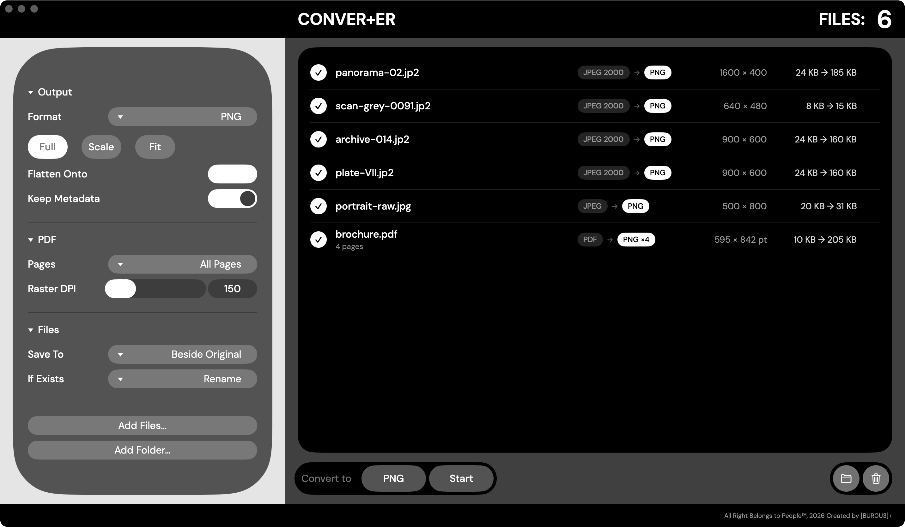
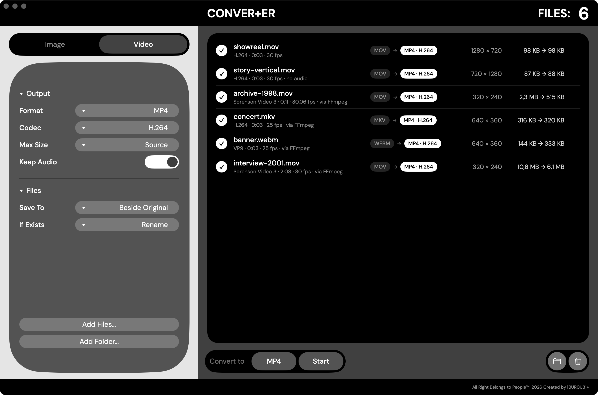
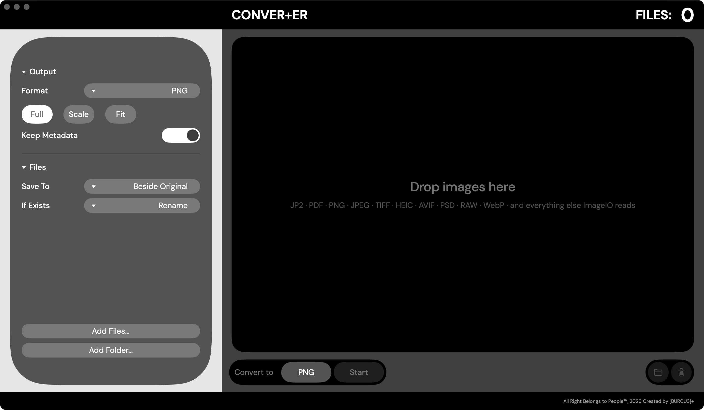

<div align="center">


# CONVER+ER

**Пакетный конвертер изображений, PDF и видео для macOS.**<br>
Бросил файлы, выбрал формат, нажал Start.

[](https://github.com/timurzi13/CONVER-ER/releases/latest/download/CONVER-ER-macos.zip)


[](LICENSE)

[English](README.md)

</div>



---

## Что умеет

Делался под одну задачу — **JP2 → PNG**, — а потом дорос до всего остального, что умеет
графический стек macOS, плюс PDF, плюс видео. Переключатель над настройками меняет
половины; у каждой своя очередь и свои настройки.

### Картинки

**Читает** JPEG 2000 · PDF · PNG · JPEG · TIFF · HEIC · AVIF · WebP · PSD · GIF · BMP ·
OpenEXR · DICOM · RAW с Canon, Nikon, Sony, Fuji, Leica, Phase One и прочих — шестьдесят
с лишним форматов.

**Пишет** PNG · JPEG · TIFF · HEIC · AVIF · JPEG 2000 · BMP · GIF · PSD · OpenEXR · PDF

### Видео

**Читает** MOV · MP4 · M4V · AVI · MPEG · MPEG-2 TS · DV · 3GP силами самой macOS, а
**MKV · WebM · FLV · WMV · Ogg · RealMedia · MXF** и старые кодеки QuickTime, от которых
Apple отказалась, — Sorenson, Cinepak, Indeo, Apple Video — через встроенный FFmpeg.

**Пишет** MOV · MP4 · M4V в H.264, HEVC, ProRes 422 или ProRes 4444 — либо **копированием
потоков**, когда они просто переупаковываются в новый контейнер без перекодирования.
MOV → MP4 так занимает секунду и не теряет ничего.



Кидайте файлы или целые папки (разворачиваются рекурсивно), можно на иконку в Dock или
через `⌘O`. Картинки и видео сами раскладываются по вкладкам; если бросить только видео,
приложение само переключится на Video. Картинки конвертируются параллельно по всем ядрам,
видео — по два за раз, чтобы аппаратные кодеки работали, а не толкались.

## Установка

1. **[Скачать последнюю версию](https://github.com/timurzi13/CONVER-ER/releases/latest)**
2. Распаковать и перетащить `CONVER+ER.app` в папку «Программы»
3. Один раз снять карантин — см. ниже

### При первом запуске macOS его не пустит

Приложение подписано ad-hoc, а не платным Apple Developer ID, поэтому система считает его
неопознанным. Лечится одной командой, навсегда:

```bash
xattr -dr com.apple.quarantine /Applications/CONVER+ER.app
```

Либо попробовать открыть, а потом зайти в **Системные настройки → Конфиденциальность и
безопасность**, пролистать вниз и нажать **Всё равно открыть**.

## Настройки

Панель показывает только то, что реально влияет на выбранный формат, — мёртвых контролов нет.

**Картинки**

| | |
|---|---|
| **Format** | формат на выходе |
| **Quality** | только форматы с потерями (JPEG, HEIC, AVIF, JP2) |
| **Full / Scale / Fit** | 1:1, в процентах, или вписать по длинной стороне |
| **Flatten Onto** | цвет, на который лягут прозрачные пиксели, если формат не держит альфу |
| **Keep Metadata** | перенести EXIF / IPTC / цветовой профиль в результат |
| **Pages** | все страницы PDF или одна конкретная |
| **Raster DPI** | с каким разрешением растрить страницу PDF, 72 — размер страницы 1:1 |

**Видео**

| | |
|---|---|
| **Format** | MOV, MP4 или M4V |
| **Codec** | Copy Streams, H.264, HEVC — и ProRes 422 / 4444 в MOV |
| **Max Size** | потолок для H.264 и HEVC; клипы меньше сохраняют свой размер |
| **Keep Audio** | выключить — получится немой клип, удобно для лупов |

**Общее**

| | |
|---|---|
| **Save To** | рядом с оригиналом или в выбранную папку |
| **If Exists** | переименовать, перезаписать или пропустить |



## Что внутри

Всё работает на **ImageIO**, **CoreGraphics** и **AVFoundation** — поддержка JPEG 2000 и
аппаратные видеокодеки в macOS давно есть, их просто нигде не дают в руки. Ставить ничего
не нужно: ни Homebrew, ни Python, ни командной строки.

Единственное, чего macOS не умеет, — читать видео, от которого она отказалась. Для этого
внутри приложения лежит собственный небольшой **FFmpeg**: только LGPL, статический,
универсальный. Он включается, только когда macOS не может открыть или декодировать файл —
в очереди тогда написано *via FFmpeg*, — и даже тогда кодирует через то же железо Apple
(VideoToolbox), а ProRes и AAC — своими кодерами.

Три вещи, на которые движок обращает внимание:

- **Без лишнего перекодирования.** При 1:1, когда нечего сводить по альфе и нет
  EXIF-поворота, распакованная картинка уходит в файл как есть. 16 бит остаются 16 битами,
  серый остаётся серым — архивный скан в JP2 не раздувается втрое, превращаясь в RGB.
- **Поворот запекается в пиксели.** PNG негде хранить EXIF-ориентацию, поэтому всё с
  orientation ≠ 1 перерисовывается. Результат сверен попиксельно с тем, как поворачивает
  сам ImageIO.
- **Страницы PDF действительно масштабируются.** `CGPDFPageGetDrawingTransform` умеет
  только вписывать с уменьшением и никогда не увеличивает, поэтому масштаб задаётся явно.
  600 dpi — это настоящие 600 dpi, а не страница в 72 dpi на большом белом листе.

PDF → PDF — это вырезание страницы, а не перерендер: вектор остаётся вектором.

По видео:

- **Copy Streams ничего не перекодирует.** Смена контейнера — это переупаковка: мгновенно
  и бит в бит.
- **Вертикальные ролики с телефона остаются вертикальными.** Телефон пишет в горизонтали
  и помечает файл как повёрнутый; этот поворот переносится во всех путях, включая немой,
  где клип приходится собирать заново из одной видеодорожки.
- **Невозможные сочетания не доходят до кодека.** ProRes существует только в MOV, поэтому
  для MP4 и M4V он просто не предлагается, а пресеты размера появляются только там, где
  они реально есть в системе.

## Собрать самому

Ни Xcode-проекта, ни пакетного менеджера, ни зависимостей — только Command Line Tools:

```bash
xcode-select --install
./build.sh
```

На выходе универсальный (Apple Silicon + Intel) `build/CONVER+ER.app`.

Чтобы внутри был FFmpeg, сначала соберите его — скрипт скачает зафиксированную версию с
ffmpeg.org, проверит SHA-256 и соберёт обе архитектуры (несколько минут, один раз):

```bash
./scripts/build-ffmpeg.sh
./build.sh
```

Без этого шага приложение тоже собирается и работает, просто не открывает форматы выше.

```
Sources/
  App.swift         окно, меню, левая колонка настроек
  Shell.swift       хедер, футер, панель, плавающие плашки
  Controls.swift    слайдер, тоггл, селект, пилюли, свотч
  ScrollArea.swift  свой скроллбар
  Stage.swift       дропзона, очередь, нижние плашки
  Model.swift       состояние, очередь, параллельный прогон
  Converter.swift   движок картинок и PDF
  VideoConverter.swift  движок видео
  FFmpeg.swift      мост к встроенному ffmpeg
scripts/
  build-ffmpeg.sh   ровно та сборка FFmpeg, что лежит в приложении
  Theme.swift       палитра, метрики, типографика
```

## Благодарности

Шрифт: [DM Sans](https://fonts.google.com/specimen/DM+Sans), SIL Open Font License.

Видео, которое не читает система: [FFmpeg](https://ffmpeg.org), LGPL 2.1 или новее. Он
работает отдельной программой внутри приложения (`Contents/Helpers/ffmpeg`) и заменяется
любой другой сборкой; лицензия, версия и флаги сборки лежат рядом в
`Contents/Resources/ThirdParty/FFmpeg`.

Сделал **[[BUR0U3]+](https://www.instagram.com/burou3_/)**

Лицензия MIT — см. [LICENSE](LICENSE).
